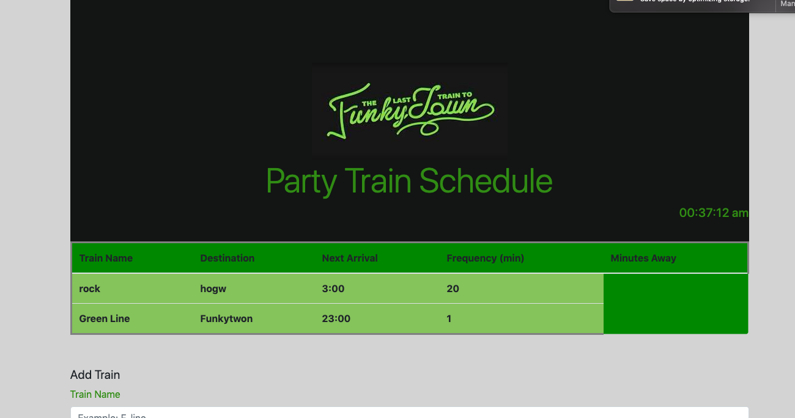

# Train-scheduler Firebase Assignment

##About
Are you looking to take a train to Funkytown? 

This train schedule application incorporates Firebase to host arrival and departure data, and will retrieve and manipulate this information with Moment.js. An up-to-date information about various trains, namely their arrival times and how many minutes remain until they arrive at their station, will be provided for the user.

When adding trains, administrators ar able to submit 1) the train name, 2) destination, 3) first train time -- in military time, and 4) frequency -- in minutes. 

This app should be able to calculate when the next train will arrive relative to the current time, but there are still some bugs to be worked out.

Users from many different machines must be able to view same train times.

Styling and theme tied with funkytown!

### Technology Used:
* [Firebase] (https://hackernoon.com/introduction-to-firebase-218a23186cd7)
* [Javascript (JS)](https://developer.mozilla.org/en-US/docs/Web/JavaScript)
* [jQuery JS Library](https://developer.mozilla.org/en-US/docs/Glossary/jQuery)
* [Hypertext Markup Language (HTML)](https://developer.mozilla.org/en-US/docs/Web/HTML)
* [Cascading Style Sheets (CSS)](https://developer.mozilla.org/en-US/docs/Web/CSS) 

## Images and Music Credits
* Banner  - https://images.app.goo.gl/8YdF6eQLpEYNPFNaA

###Author
* **Joey Badua** - [Train-scheduler](https://github.com/joannebadua)

